# Single-Cell Virtual Cytometer (Go + Fyne Port)

[](https://www.gnu.org/licenses/gpl-3.0)
[](https://go.dev/)
[](https://fyne.io/)

A native desktop port of the **Single-Cell Virtual Cytometer** (originally written in JS/Plotly) to **Go** using the **Fyne** toolkit (the software is a compiled binary, no complex installation required !).

## 📖 Description

**Single-Cell Virtual Cytometer** is open-source software designed for the straightforward visualization and exploration of multimodal single-cell datasets, similar to flow cytometry analysis.

This specific repository is a **high-performance port** of the original JavaScript implementation. By moving from a web-based environment to a native Go application, this version offers:
* **Enhanced Memory Management:** Ability to handle millions of cells via direct rasterization.
* **Smoother Interaction:** Native desktop responsiveness for zooming and panning.
* **Advanced Gating:** Improved quadrant gating and sequential selection tools.
* **Works great with Single-Cell Signature Explorer:** Virtual Cytometer pairs naturally with
[Single-Cell Signature Explorer](https://github.com/FredPont/Single-CellSignatureExplorer),
which computes pathway/signature scores per cell extremely fast. Since
Signature Explorer's output is just another column per cell, you can
load it directly in Virtual Cytometer and use any pathway score exactly
like a gene, protein, or marker — as an X/Y axis, a gating criterion, or
a "Color by" column — right alongside your regular expression data.

## 📝 How to Cite

If you use this software in your research, please cite the original work:

> [Pont, F., Tosolini, M., Gao, Q., Perrier, M., Madrid-Mencía, M., Huang, T. S., ... & Fournié, J. J. (2020). Single-Cell Virtual Cytometer allows user-friendly and versatile analysis and visualization of multimodal single cell RNAseq datasets. NAR genomics and bioinformatics, 2(2), lqaa025.](https://doi.org/10.1093/nargab/lqaa025)


## 📺 ScreenShots
### Single-Cell RNAseq
#### Quadrants and UMAP with density plot (5559 cells)
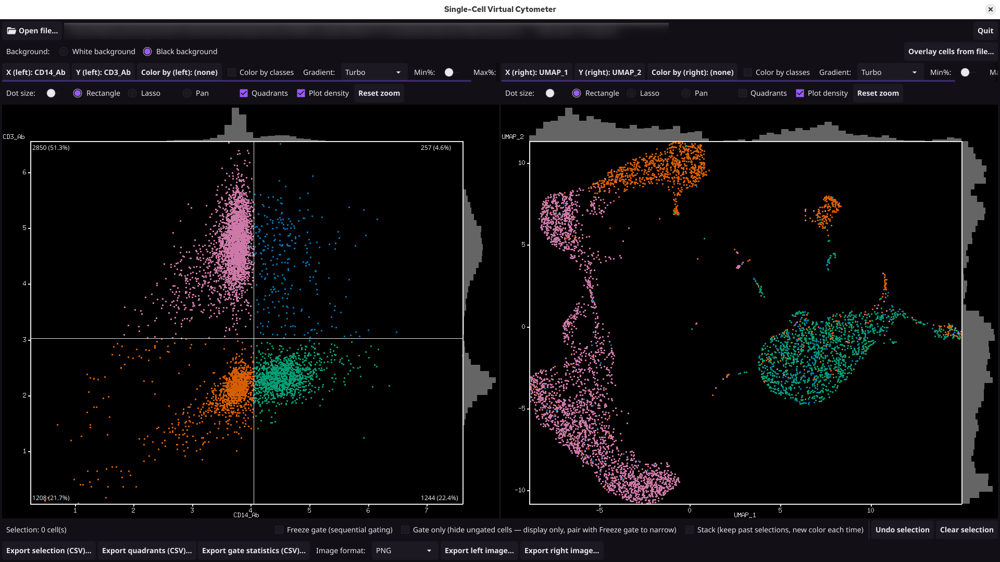

#### Simple gate
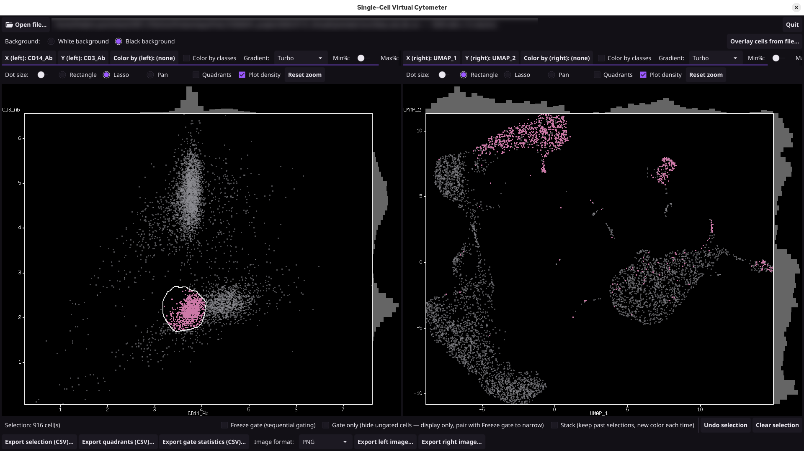

#### Gate with stack
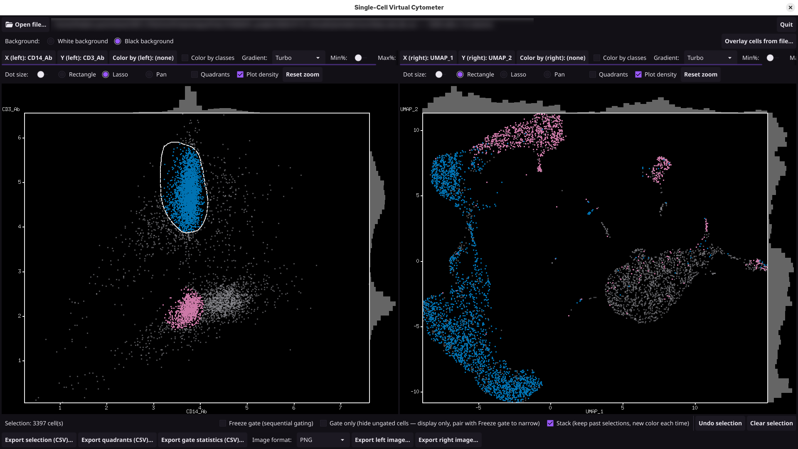

#### Quadrants and t-SNE (7776 cells)
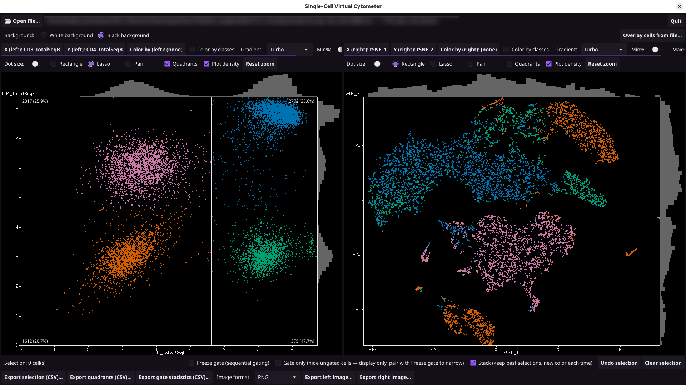

#### Color by clusters without density plot
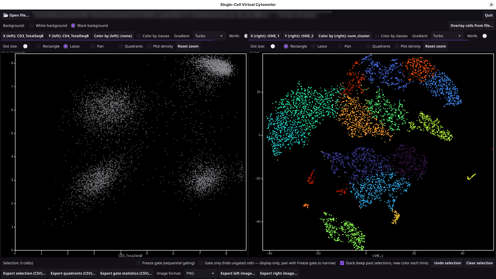

#### Color by clusters (178597 cells)
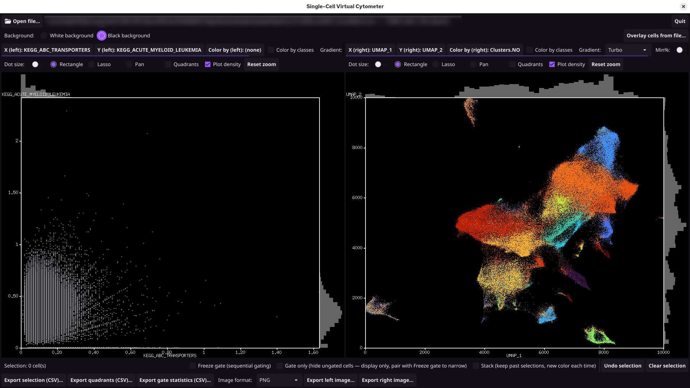

#### Color by pathway (apoptosis)
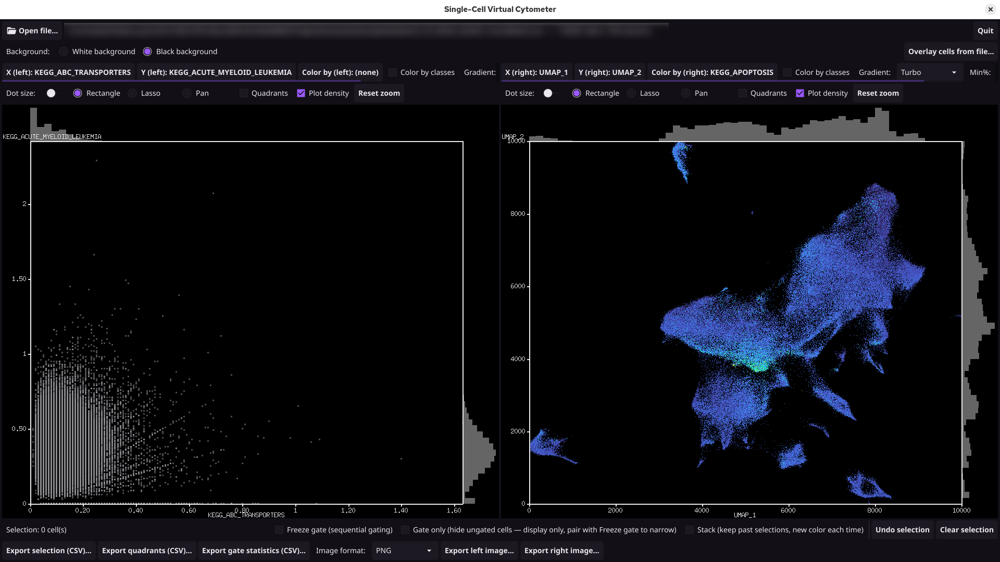


#### Color by pathway (Cell Cycle)
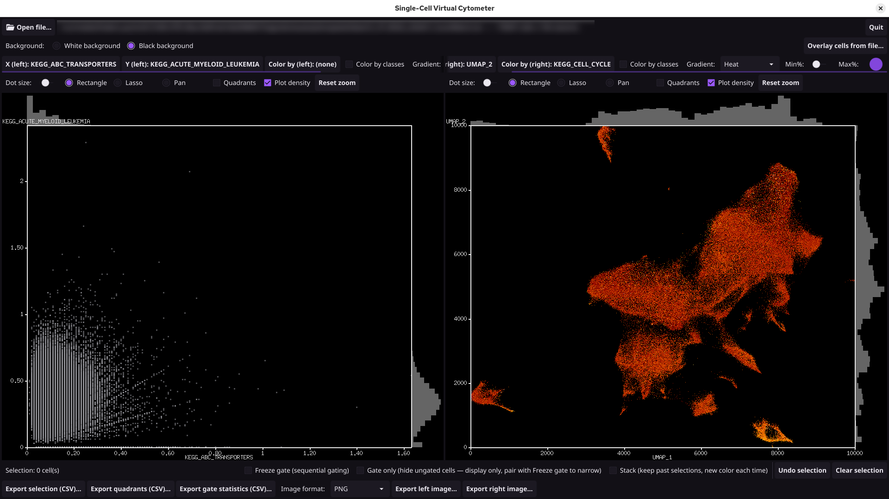

### 3 gates stacked
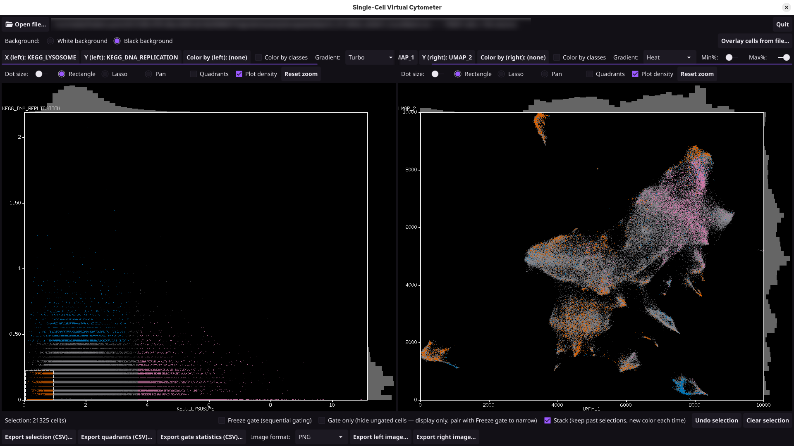

## Microscopy
#### Color by Ki67 (2.2 millions cells)
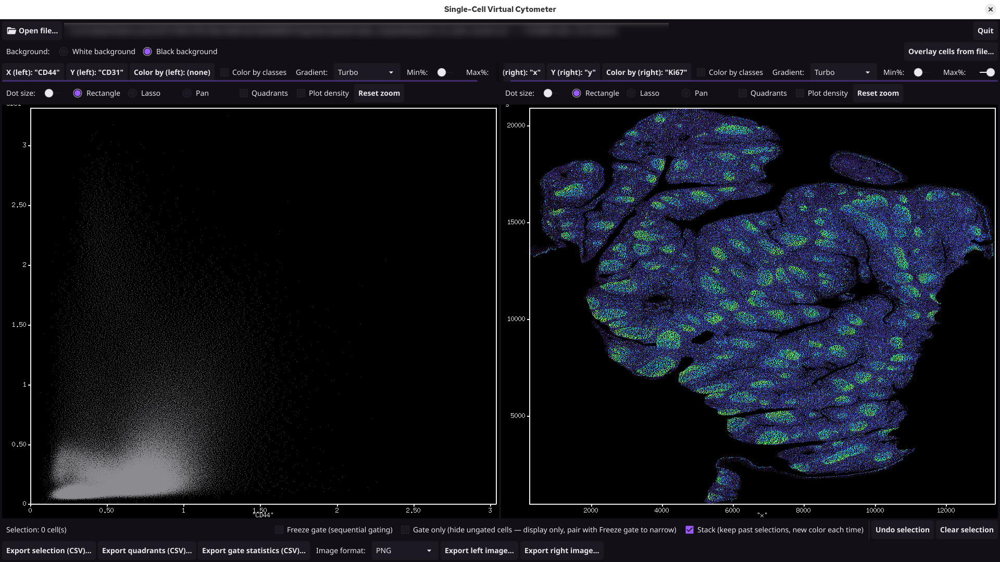

#### Color by PCNA
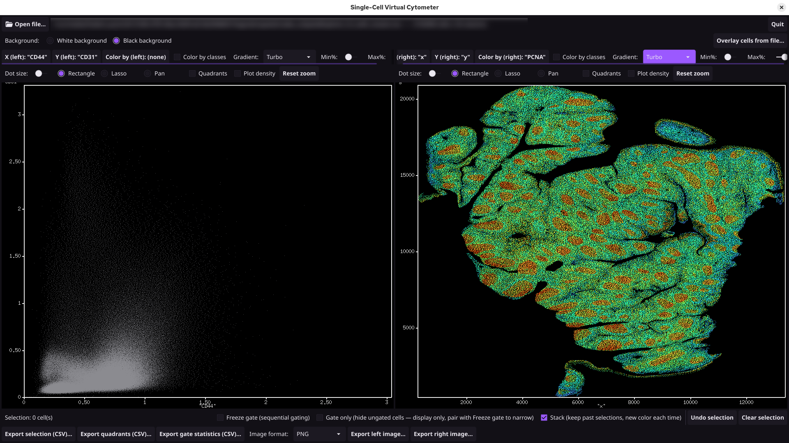

#### Quadrants CD8/CD20
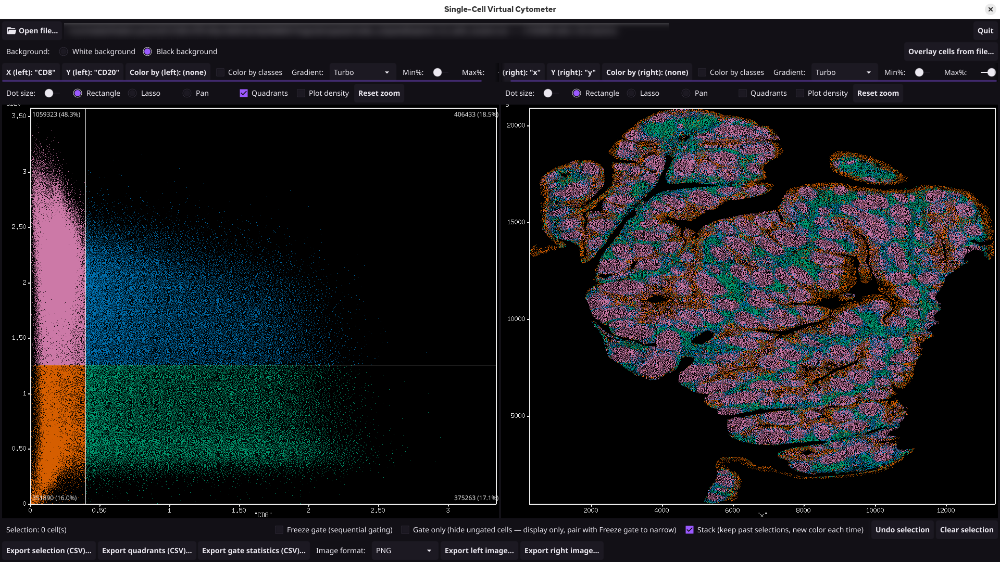

#### Zoom (CD44)
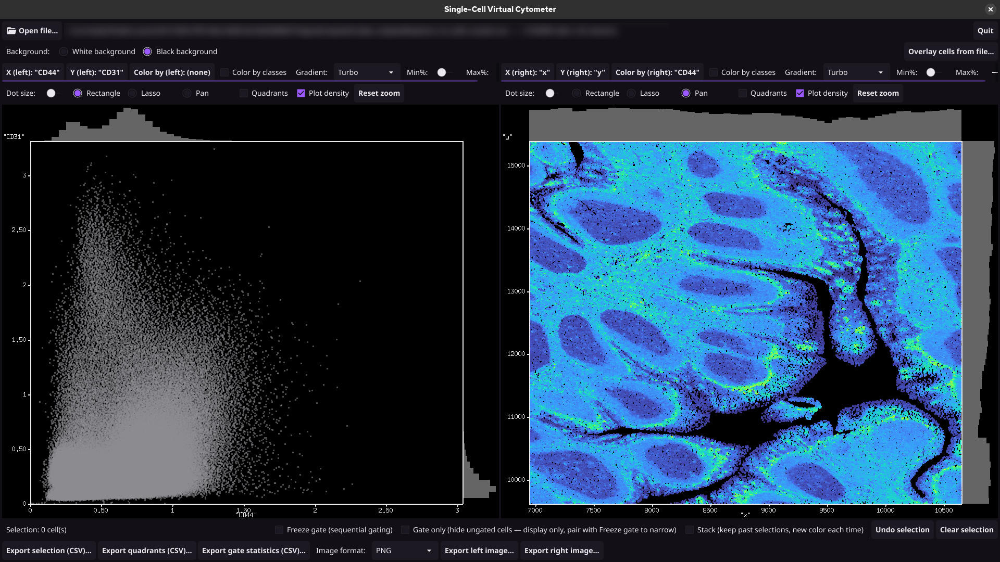

## ✨ Features

* **Multi-panel Synchronization:** Cross-plot selection (lasso or rectangular brush) in one panel automatically highlights the same cells in the other.
* **High-Performance Rendering:** Points are rasterized directly into an image buffer, preventing memory bloat even with massive datasets.
* **Advanced Gating Tools:**
    * Sequential (freeze) gating.
    * Cumulative "gate only" display.
    * Quadrant-gate mode with real-time live counts and percentages.
* **Robust Data Import:** Intelligent detection of delimiters (Tab, Semicolon, Comma) for CSV/TSV files.


Single-Cell Virtual Cytometer shows two linked scatter plots side by
side. Any selection, gate, or color choice you make on one plot is
reflected on the other — they share the same underlying cells, not just
the same window.

## Plots & navigation

- **Two independent, linked plots** — pick any pair of numeric columns
  (markers, UMAP/t-SNE coordinates, anything numeric) on each panel
  independently.
- **Graduated axis frame**, always on: a proper bordered frame with tick
  marks and numeric labels on both axes, the way a real scientific plot
  should look — not a bare scatter of dots.
- **Marginal density histograms** ("Plot density" toggle) along the top
  and right edges, flow-cytometry style, showing the per-slice cell
  density for whatever's currently in view.
- **Pan / zoom / select tool switcher** per plot: Rectangle, Lasso, or
  Pan. Zooming is centered on the cursor and only ever affects the inner
  plot area — the axis frame and histograms stay in place and keep
  updating to match.
- Built to stay smooth from a few thousand cells up into the millions:
  points are rasterized directly rather than created as individual UI
  objects, and on-screen rendering adaptively sub-samples dense views
  (gating, statistics, and exports always use every single cell,
  regardless of what's shown on screen).

## Selection

- **Rectangle or lasso brushing**, on either plot, highlights the same
  cells on both — the dashed outline of your selection stays visible
  until you make a new one.
- **Undo** steps back through your last several selections.
- A plain click clears the current selection.

## Gates

- **Freeze gate** — turns brushing into *sequential* (hierarchical)
  gating: each new selection only keeps cells that were already
  selected, so you can narrow a population down step by step, switching
  axes between steps if you like.
- **Gate only** — hides every cell outside the current selection on both
  plots, the classic "show me just this gate" display.
- **Stack** — instead of replacing your selection, each new one is added
  as an independently colored population on top of the previous ones.
  Handy for comparing several gates picked on different marker
  combinations side by side.
- **Quadrant gate** — click to drop a crosshair on either plot; live cell
  counts and percentages appear in each of the four quadrants, and the
  four quadrant colors carry over to the *other* plot too, computed from
  the same cells.
- **Overlay cells from file** — bring in a list of cell ids (plain text,
  or a file exported by this app) and highlight them, in one consistent
  color, on both plots.

## Color by

- A third picker, independent of the plot axes, colors cells by any
  column:
  - a **text** column gets one flat color per distinct value;
  - a **numeric** column gets a continuous color gradient by default, or
    one color per value if it has few enough distinct values — a
    cluster id, for instance — detected automatically, or forced with
    the **"Color by classes"** checkbox.
- Classes beyond the first handful don't run out of colors: once there
  are more than the qualitative palette comfortably covers, further
  classes are generated by sampling the chosen gradient, so 20+ clusters
  still get 20+ genuinely distinct colors.
- **Gradient choice** — Viridis, Turbo, or Heat.
- **Min% / Max% clipping sliders** stretch the color scale to a chosen
  sub-range of the data, live — so a few abnormally low or high cells
  don't wash out the contrast for everyone else.

## Appearance

- A dark theme with a purple accent, applied throughout the interface.
- **White or black plot background**, switched live, with everything
  drawn on it (frame, histograms, labels) automatically adapting for
  contrast.
- Per-plot adjustable dot size.

## Export

- **Selected cells** to CSV, at full precision, in original row order.
- **Quadrant membership** (Q1–Q4) for the whole dataset to CSV, with
  per-quadrant counts and percentages included as header comments.
- **Gate statistics** to CSV: mean, median, SD, variance, and CV for
  every numeric column, for the current selection (and for each
  individual Stack layer, if you're using Stack).
- **Plot images**, as PNG or SVG, in the same white/black background
  currently shown on screen. SVG export keeps the frame, axis labels,
  histograms, and selection outline as real, scalable vector elements,
  not just a flat picture.


## Quickstart (precompiled release)

No Go toolchain needed — just download and run.

### Linux

1. Go to the [Releases](../../releases) page and download `scvc` from the
   latest release.
2. Make it executable:
```bash
   chmod +x scvc
```
3. Run it:
```bash
   ./scvc
```

If it doesn't start, your system may be missing the OpenGL/X11 runtime
libraries — normally already present on any Linux desktop, but if not:
`sudo apt install libgl1 libx11-6` (Debian/Ubuntu), or the equivalent
package on your distro.

### Windows

1. Go to the [Releases](../../releases) page and download `scvc.exe` from
   the latest release.
2. Double-click `scvc.exe` to run it.
3. Windows may show a "Windows protected your PC" SmartScreen warning,
   since the binary isn't code-signed. Click **More info**, then **Run
   anyway**.


### Data format

The app reads a plain text table — `.csv`, `.tsv`, or `.txt` — with
comma, tab, or semicolon as the delimiter; it's detected automatically,
so you don't need to pick one. Requirements:

- **A header row** on the first line, naming every column.
- **The first column is the cell identifier** (an id, barcode, or any
  value unique per row) — required, and used for CSV export and for
  matching cells when importing an overlay file.
- **Every other column is one variable per cell**: marker intensities,
  UMAP/t-SNE coordinates, cluster numbers, cell type labels, etc., in
  any order.

Each column's type — numeric or text — is detected automatically from
its first data row, so keep a given column consistently one or the
other (don't mix numbers and text within the same column). Numeric
columns (markers, coordinates, cluster ids…) can be used as X/Y axes or
for "Color by"; text columns (cell type names, sample names…) are
offered only for "Color by", since they wouldn't make sense as a plot
axis.

Example:

| id     | CD3 | CD4 | CD8 | CD19 | UMAP_1 | UMAP_2 | cluster | cell_type |
|--------|-----|-----|-----|------|--------|--------|---------|-----------|
| cell_1 | 120 | 45  | 10  | 300  | -3.2   | 5.1    | 2       | T cell    |
| cell_2 | 15  | 8   | 210 | 20   | 1.7    | -2.4   | 0       | B cell    |


A cell left blank, or containing something that isn't a number, in an
otherwise numeric column is treated as missing data for that cell
(shown as muted grey when used for "Color by", and excluded from
exported statistics) rather than failing the whole import.

## 🚀 Installation & Usage


### Prerequisites

* [Go](https://go.dev/) (version 1.22 or higher)
* A C compiler (e.g., `gcc` on Linux/macOS, or `MinGW` on Windows) for the Fyne graphics drivers.


## 🛠 Compilation via Makefile

This project includes a `Makefile` to automate cross-platform builds using [fyne-cross](https://github.com/fyne-io/fyne-cross). This method uses Docker to ensure the correct C toolchains (like MinGW for Windows) are used for native graphics.

### Prerequisites

To use the automated build commands, you must have the following installed:
* **Go** (version 1.19 or higher)
* **Docker** (running and accessible by your user)
* **fyne-cross** installed via:
  ```bash
  go install github.com/fyne-io/fyne-cross@latest